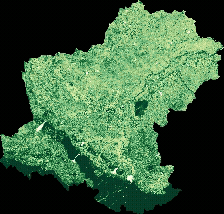

# NDVI Monitoring for Nakhon Ratchasima 2024

This project uses **Google Earth Engine (GEE)** and **Google Colab** 
to calculate NDVI values for croplands in Nakhon Ratchasima, Thailand.  
Results include animated GIF/MP4 NDVI time-series.

## Features
- Compute NDVI from Sentinel-2 imagery
- Generate animated GIF/MP4 time-series

## Folder Structure
- `notebooks/` : Google Colab notebook code
- `data/` : Output files (GIF, MP4)

## How to run
1. Open `NDVI_to_GIF.ipynb` in Google Colab
2. Authenticate with Google Earth Engine
3. Run all cells
4. Outputs will be saved to `/data`

## NDVI Animation (GIF)

NDVI-Korat-2024/notebooks/data

